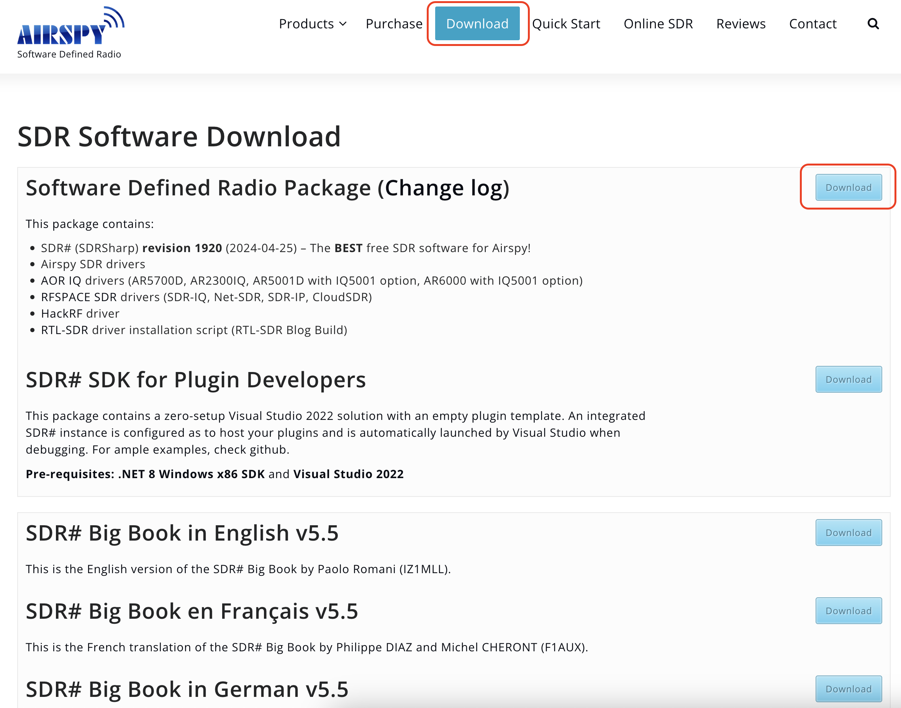
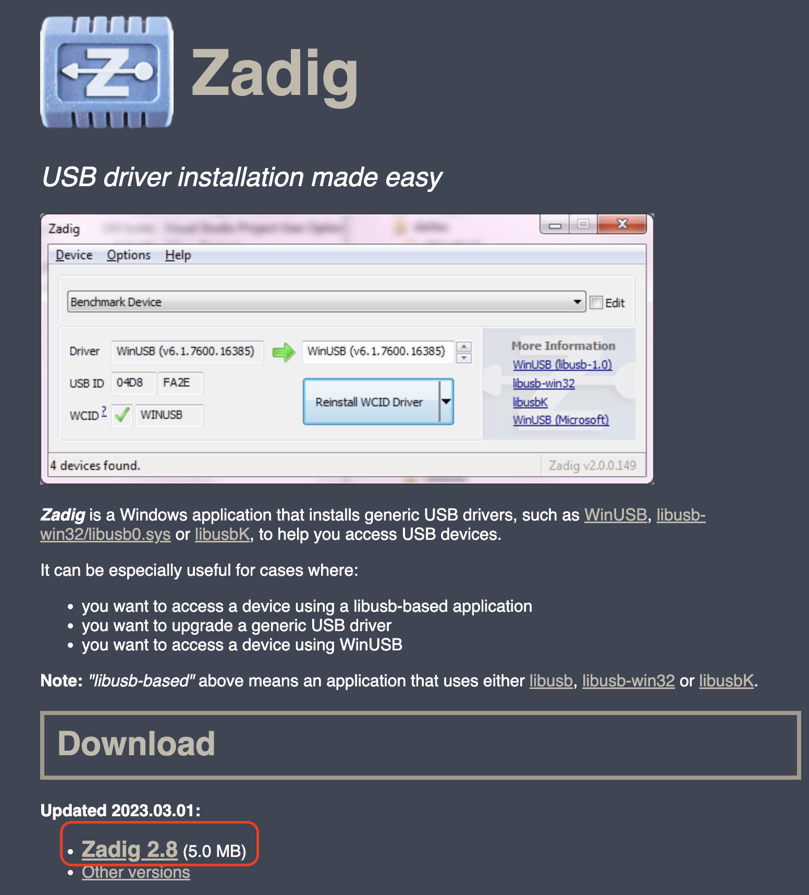
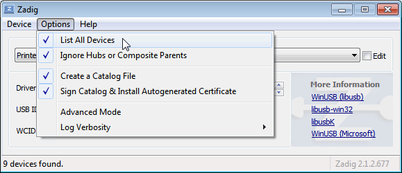
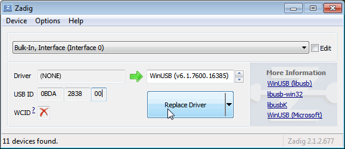
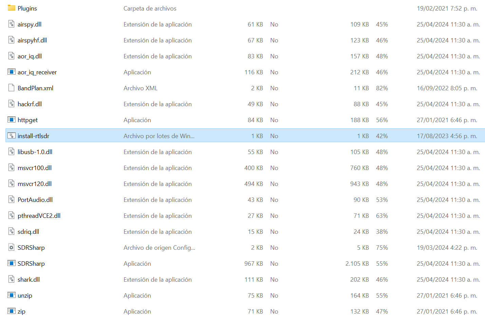
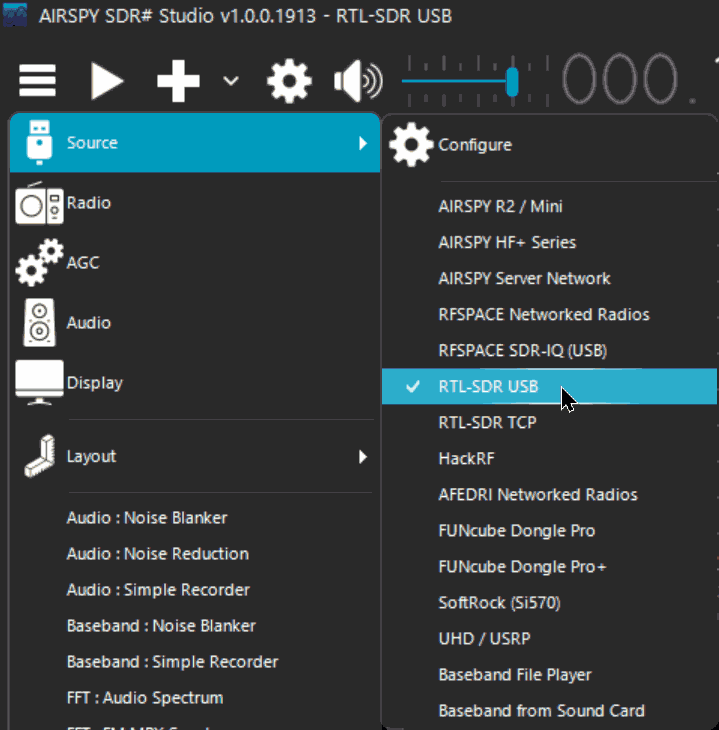
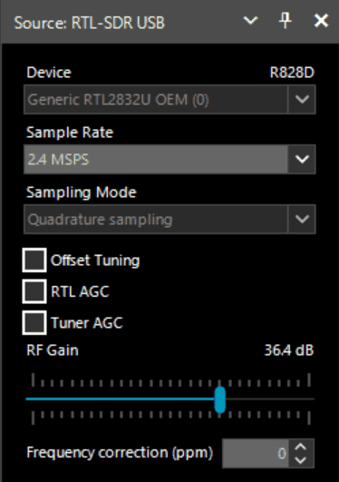

# Quick Start Guide

Microsoft .NET 7.0 x86 Desktop Runtime is required to use SDRSharp. Most modern computers will have already received this update automatically, unless you have specifically disabled updates on your computer.

In addition, it is necessary to have the Microsoft Visual C++ redistributable installed. Most computers will already have this installed, but as a precaution, you can download the x86 version from this link.

Visit the site [www.airspy.com](http://www.airspy.com/) and look for the downloads section in the top menu. Next to the title “Software Defined Radio Package”, click the download button to get the sdrsharp-x86.zip file. Avoid downloading the community-managed version as it often has malfunctions.

## Previous requirements

1. **DEEPRAD Receiver**: Make sure you have a compatible DEEPRAD dongle.
2. **Windows PC**: This manual is based on the Windows operating system.
3. Microsoft .NET 7.0 x86 Desktop Runtime is required to use SDRSharp. Most modern computers will have already received this update automatically, unless you have specifically disabled updates on your computer.
4. Additionally, it is necessary to have the Microsoft Visual C++ redistributable installed. Most computers will already have this installed.

### Step 1: Download SDR#

1. **Visit the official Airspy website**:
    - URL: Airspy Download
2. **Download SDR software#**:
    - Find the SDR# download section and click the link to download the compressed package.
    
        

### Step 2: Download and configure Zadig

1. **Download Zadig**:
    - Go to the official Zadig website: Zadig
    - Download the latest version of Zadig.
        
        

2. **Install the WinUSB driver**:
    - Connect your DEEPRAD receiver to the USB port of your PC.
    - Open Zadig and select `Options` > `List All Devices`.
        
        
        
    - From the drop-down list, select your RTL-SDR device (it may appear as `Bulk-In, Interface (Interface 0)` or similar).
    - Make sure the driver selected in the right column is `WinUSB`.
    - Click `Replace Driver` or `Reinstall Driver`.

        

### Step 3: Configure SDR#

1. **Unzip SDR#**:
    - Extract the contents of the compressed file downloaded from the Airspy page to a folder of your choice.
2. **Configure SDR#**:
    - Navigate to the folder where you extracted SDR#.
    - Open the file `SDRSharp.exe.config` (can be opened with Notepad).
    - Make sure the file `rtl-sdr.dll` is present in the folder.    
    
        

### Step 4: Run SDR#

1. **Open SDR#**:
    - Run the file `SDRSharp.exe`.
2. **Select device**:
    - In the SDR# interface, find the drop-down menu at the top that says `Source` and select `RTL-SDR (USB)`.

        

3. **Set initial parameters**:
    - Click the `Configure` button (wrench icon next to `Source`).
    - Adjust the parameters according to your needs (gain, sample rate, etc.).

### Step 5: Start reception

1. **Select a frequency**:
    - Enter a desired radio frequency in the frequency field.
    
        
    
2. **Start Scan**:
    - Click the `Play` button (triangle icon) to start receiving signals.

### Additional Tips

- **Antenna**: Make sure your DEEPRAD is connected to a suitable antenna to improve reception.
- **Missing drivers**: If you experience problems with the drivers, make sure that the receiver is properly connected and that Zadig has correctly installed the WinUSB driver.

### Additional Resources

- **Online guides and tutorials**:
    - RTL-SDR Blog Quick Start Guide
- **Forums and communities**:
    - [Reddit r/RTLSDR](https://www.reddit.com/r/RTLSDR/)
    - RTL-SDR Google Group

This manual should help you get started with SDR# and your DEEPRAD device. Enjoy exploring the world of software defined radio!