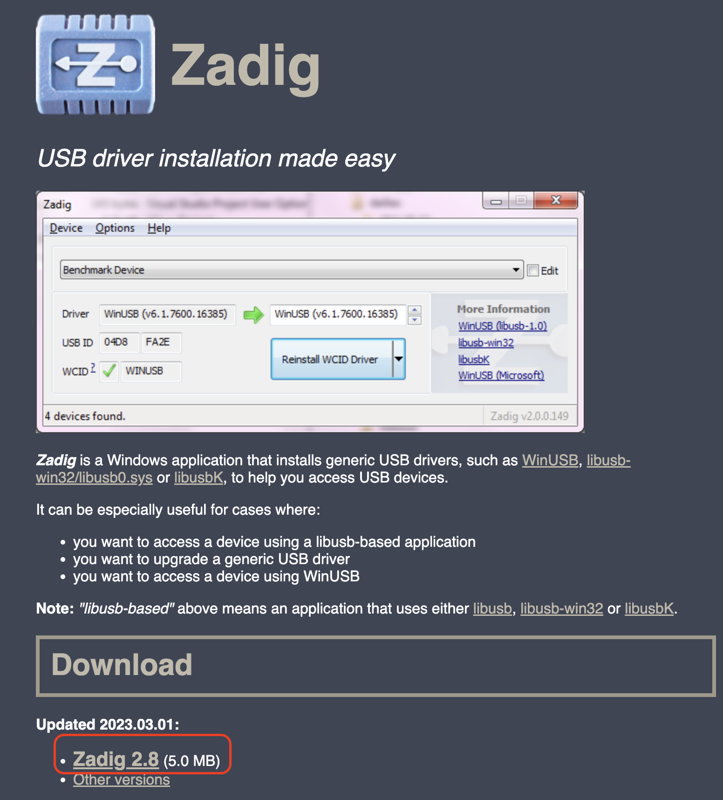
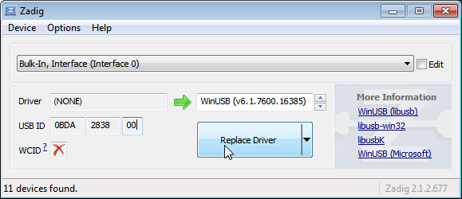
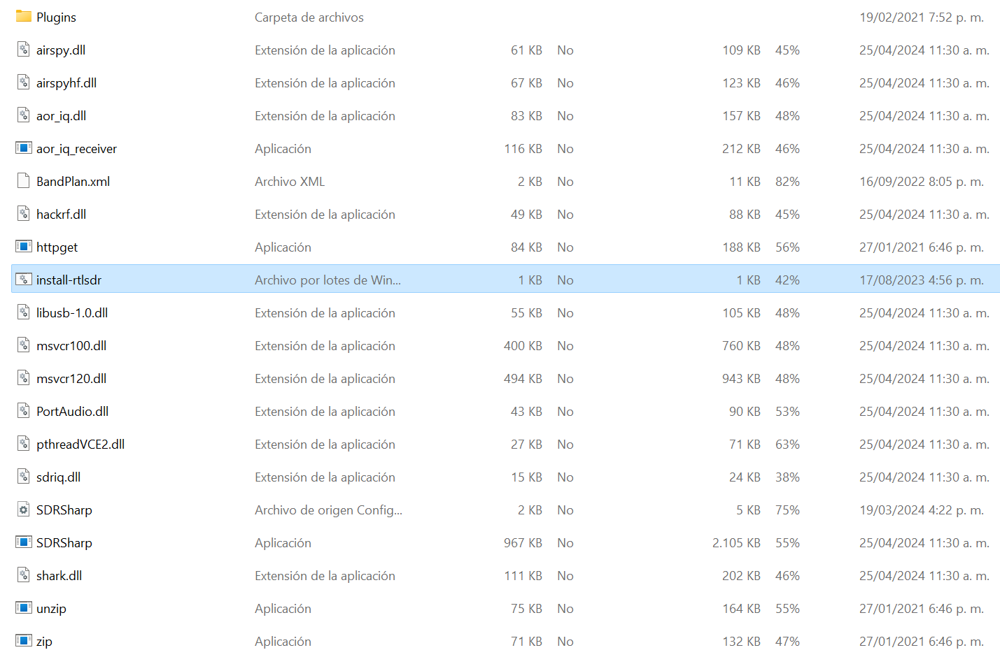
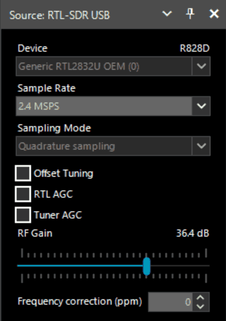

# Guía de Inicio Rápido

Es requerido contar con Microsoft .NET 7.0 x86 Desktop Runtime para poder utilizar SDRSharp. La mayoría de las computadoras modernas ya habrán recibido esta actualización de forma automática, a menos que haya desactivado específicamente las actualizaciones en su computadora.

Además, es necesario contar con la instalación del redistribuible de Microsoft Visual C++. La mayoría de las computadoras ya contarán con esto instalado, pero por precaución, puede descargar la versión x86 desde este enlace.

Visite el sitio [www.airspy.com](http://www.airspy.com/) y busque el apartado de descargas en el menú superior. Junto al título "Paquete de radio definido por software", haga clic en el botón de descarga para obtener el archivo sdrsharp-x86.zip. Evite descargar la versión administrada por la comunidad, ya que suele presentar errores de funcionamiento.

### Requisitos previos

1. **Receptor**: Asegúrate de tener un dongle DEEPRAD.
2. **PC con Windows**: Este manual se basa en el sistema operativo Windows.
3. Es requerido contar con Microsoft .NET 7.0 x86 Desktop Runtime para poder utilizar SDRSharp. La mayoría de las computadoras modernas ya habrán recibido esta actualización de forma automática, a menos que haya desactivado específicamente las actualizaciones en su computadora.
4. Además, es necesario contar con la instalación del redistribuible de Microsoft Visual C++. La mayoría de las computadoras ya contarán con esto instalado.

### Paso 1: Descargar SDR#

1. **Visita la página oficial de Airspy**:
    - URL: Airspy Download
2. **Descargar el software SDR#**:
    - Busca la sección de descarga de SDR# y haz clic en el enlace para descargar el paquete comprimido.
    
        

### Paso 2: Descargar y configurar Zadig

1. **Descargar Zadig**:
    - Ve a la página oficial de Zadig: Zadig
    - Descarga la última versión de Zadig.
            
        

2. **Instalar el driver WinUSB**:
    - Conecta tu receptor DEEPRAD al puerto USB del PC.
    - Abre Zadig y selecciona `Options` > `List All Devices`.
    
        
    
    - En la lista desplegable, selecciona tu dispositivo RTL-SDR (puede aparecer como `Bulk-In, Interface (Interface 0)` o similar).
    - Asegúrate de que el driver seleccionado en la columna derecha sea `WinUSB`.
    - Haz clic en `Replace Driver` o `Reinstall Driver`.
    
          

### Paso 3: Configurar SDR#

1. **Descomprimir SDR#**:
    - Extrae el contenido del archivo comprimido descargado de la página de Airspy a una carpeta de tu elección.
2. **Configurar SDR#**:
    - Navega a la carpeta donde extrajiste SDR#.
    - Abre el archivo `SDRSharp.exe.config` (puede abrirse con el Bloc de notas).
    - Asegúrate de que el archivo `rtl-sdr.dll` esté presente en la carpeta.
    
        

### Paso 4: Ejecutar SDR#

1. **Abrir SDR#**:
    - Ejecuta el archivo `SDRSharp.exe`.
2. **Seleccionar el dispositivo**:
    - En la interfaz de SDR#, busca el menú desplegable en la parte superior que dice `Source` y selecciona `RTL-SDR (USB)`.

        
    
3. **Configurar parámetros iniciales**:
    - Haz clic en el botón `Configure` (ícono de llave inglesa al lado de `Source`).
    - Ajusta los parámetros de acuerdo a tus necesidades (ganancia, frecuencia de muestreo, etc.).

### Paso 5: Iniciar la recepción

1. **Seleccionar una frecuencia**:
    - Ingresa una frecuencia de radio deseada en el campo de frecuencia.
    
        
    
2. **Iniciar el escaneo**:
    - Haz clic en el botón `Play` (icono de triángulo) para empezar a recibir señales.

### Consejos adicionales

- **Antena**: Asegúrate de que tu DEEPRAD esté conectado a una antena adecuada para mejorar la recepción.
- **Faltan drivers**: Si experimentas problemas con los drivers, asegúrate de que el receptor esté bien conectado y que Zadig haya instalado correctamente el driver WinUSB.

### Recursos adicionales

- **Guías y tutoriales en línea**:
    - RTL-SDR Blog Quick Start Guide
- **Foros y comunidades**:
    - [Reddit r/RTLSDR](https://www.reddit.com/r/RTLSDR/)
    - RTL-SDR Google Group

Este manual debería ayudarte a comenzar con SDR# y tu dispositivo DEEPRAD. ¡Disfruta explorando el mundo de la radio definida por software!